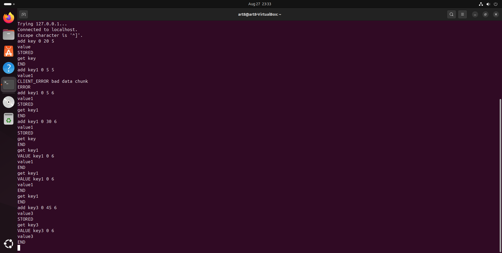

# Домашнее задание к занятию «Кеширование Redis/memcached» Artem Zhdanov

## Задание 1

Кеширование решает следующие проблемы:

- **Ускорение загрузки веб-страниц:** Кеширование сохраняет сгенерированные страницы, что уменьшает время отклика сервера.
- **Снижение нагрузки на базу данных:** Часто запрашиваемые данные хранятся в кеше, что уменьшает количество запросов к базе данных и снижает нагрузку на сервер.
- **Оптимизация работы распределенных систем:** Кеширование данных на локальных серверах ускоряет доступ к ним, уменьшая задержки.
- **Сокращение времени ответа API:** Результаты вызовов API сохраняются в кеше, что ускоряет ответ системы, уменьшая количество внешних запросов.
- **Повышение отказоустойчивости:** В случае сбоя основного источника данных, кешированные данные могут временно обеспечивать доступ.
- **Экономия ресурсов:** Кеширование снижает необходимость повторных вычислений и уменьшает затраты на ресурсы.

## Задание 2

Скриншот, показывающий статус `memcached`:

## Задание 3

Скриншоты команд `add key1` и `add key3`:

## Задание 4

Скриншот вывода команды `KEYS` в Redis:

